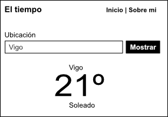

# App el tiempo



Links a proyectos:

Haz tu versión y envíanos una pull request con la URL a tu proyecto para incluírlo aquí.

- https://github.com/seralot/AppTiempo
- https://github.com/carlacid/Tiempoapp
- https://github.com/CM-CA/hogwarts

## Tareas

Las siguientes tareas están pensadas para realizar paso a paso, antes de continuar con la siguiente, validaremos la actual.

### 1. Bootstrap

- Escoger nombre de la aplicación
- Leer tipos de licencias en choosealicense.com
- Crear repositorio en GitHub y escoger una licencia
- Instalar vue-cli y crear nueva app de vue con la herramienta en este nuevo repo que hemos creado

### 2. Crear esqueleto

- Escoger un framework CSS (Bootstrap, Bulma, ...) o hacer a mano
- Añadir a nuestro index el css del framework escogido o añadir a mano estilos MUY básicos
- Crear nuestras dos primeras pantallas / urls (no molestarse con los estilos todavía):
    - Instalar vue-router con vue-cli 
    - Ruta / template Home: Aquí estará la app en sí, de momento mostramos el logo/imagen si tenemos y algún breve texto
    - Ruta / template About: Aquí añadiremos una breve descripción de la app y/o de nosotros


### 3. Añadir funcionalidad de mostrar el tiempo desde una API ficticia

Trabajaremos en la pantalla Home con la siguiente funcionalidad.

- Añadir en nuestro componente “Home” en el “data” de Vue el siguiente JSON que simulará, de momento, las llamadas a una API mínima que nos de el tiempo:
{
    “vigo”: {
        “Id”: 1,
	    “ciudad”: “Vigo”,
        “Grados”: 21,
        “Tiempo”: “nublado”
    },
    // ...añadir más opciones si queremos
}

- Añadiremos una caja de texto donde introducir la ciudad/ubicación de la que queremos obtener el tiempo
- Añadiremos un botón a pulsar para disparar la acción de buscar el tiempo.

Ahora debemos engancharnos al evento "click" del botón buscar y si tenemos la información de la ubicación solicitada mostrarla, de lo contrario indicar que no disponemos datos para esa ubicación.
Para ello necesitaremos:
    - Un método de Vue al que le pasemos una ubicación y nos devuelva de nuestra API ficticia el resultado que coincida con la ubicación, de lo contrario devolveremos “null”
    - Guardar el resultado del evento "click" de búsqueda en una variable de vue
    - En la plantilla de vue pintar la información según proceda

Una vez tengamos todo funcionando, mejoraremos el código creando un componente de Vue independiente para pintar los datos para poder reutilizarlo.
Ejemplo:

```JS
<weather-displayer :data="data"></weather-displayer>
```

### 4. UI

- Dar estilos para personalizar: Escoger una paleta de colores, añadir pie, cabecera y si queremos incluso un logo
- Mapearemos los resultados de tiempo con imágenes o icónos que queramos. Así, además de poner tiempo “nublado” pondremos un icono que corresponda con el mismo 
- Debe verse bien en móviles y en escritorio, dando preferencia al móvil


### 5. Obtener los datos de una API

- Buscar una API OpenSource que nos dé el tiempo para utilizar en nuestra app. P.E. Meteogalicia (MeteoSix) 
- Instalar la librería axios con npm para hacer llamadas a esta API
- Cambiar nuestra API ficticia por llamadas a la API que hemos escogido
    - Esto puede provocar que tengamos que hacer más cambios porque según la API escogida la información que nos devuelva va tener una estructura diferente

### 6. Desplegar

Para cerrar el círculo subiremos el proyecto a producción con la capa gratuíta de Heroku.

Seguir el tutorial oficial de Heroku:
- https://devcenter.heroku.com/articles/getting-started-with-nodejs

### 7. Mostrar más información

- Añadir más información a las búsuqedas:
    - Previsión de los próximos días
    - Viento
    - Mareas
    - Etc.

- Guardar la última ubicación que se ha buscado, y aunque se cierre la página, al volver recordar y cargar los datos de esa ubicaicón